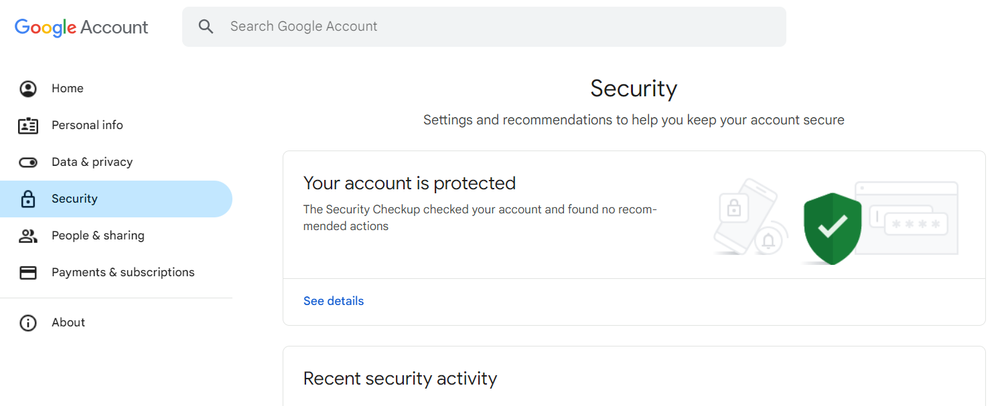
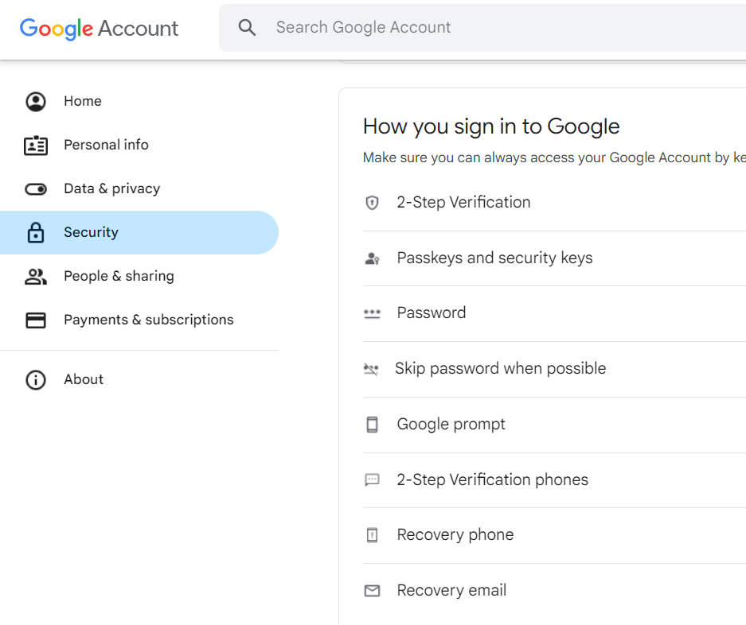
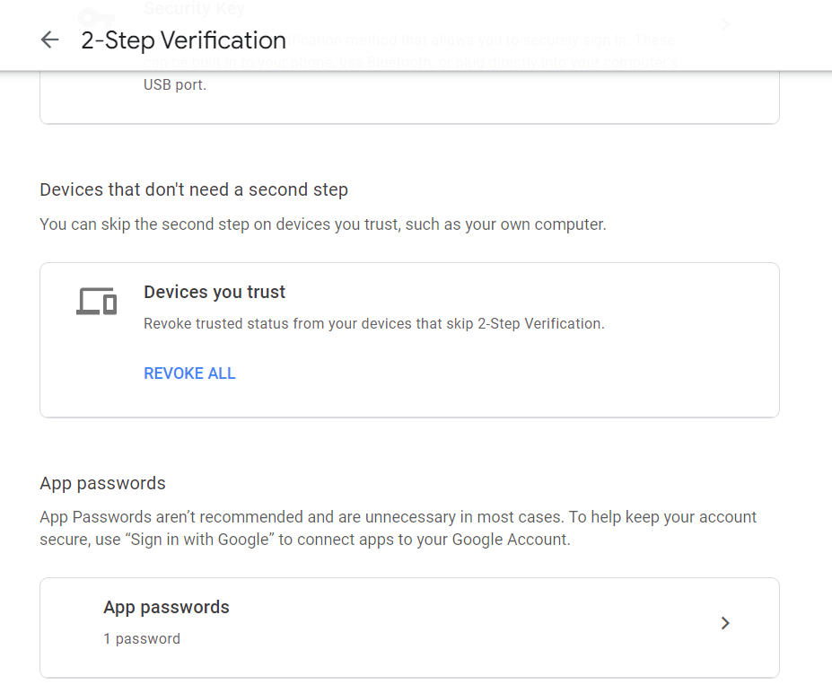
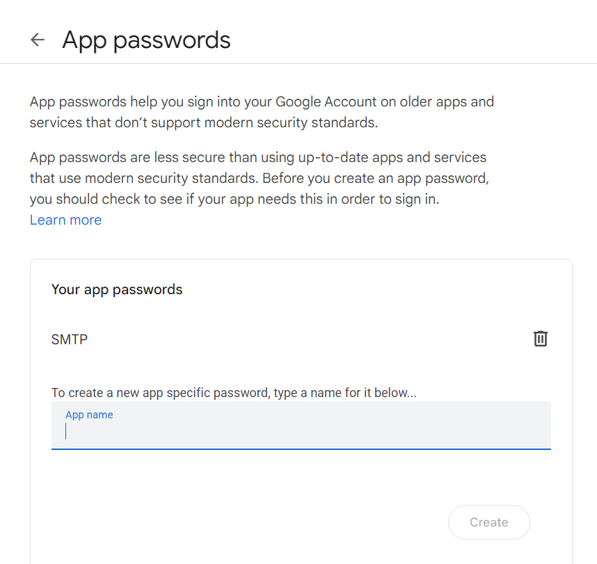

# Gmail + Whatsapp Smart Messenger
Quickly summarize the content and get the information you need from private large unstructured documents stored in your PC and also automate communication through GMail and Whatsapp.
It utilizes the LLM's ability to respond appropriately to prompts and uses to RAG to give some pre-context to the LLM for highly relevant answers. Also we can directly send these responses to contacts through Gmail automatically and also through Whatsapp Web application.
## Demo
See how the tool works:</br></br>


As you can see the LLM App enables AI-powered search from multiple unstructured documents like personal information or any other statistical or theoritical data in real-time just after you upload files to the Files folder and also enables on-spot email service using Gmail and Whatsapp messaging provided you are already logged into Whatsapp Web using your Whatsapp account.
## How to run the tool
### Run with docker
1. Create a google app password for your account. To do this:</br>
    Step 1: Go to your Google Account.</br>
    Step 2: Navigate to Security</br></br>
</br></br>
    Step 3: Under "Signing in to Google," select 2-Step Verification.</br></br>
</br></br>
    Step 4: At the bottom of the page, select App passwords.</br></br>
</br></br>
    Step 5: Enter a name that helps you remember where you'll use the app password.</br>
Select Generate.</br></br>
</br>
</br>
2. Create .env file in the root directory of the project, copy and paste the below config. Replace the <code>OPENAI_API_TOKEN</code> configuration value with your key <code>{OPENAI_API_KEY}</code> and replace <code>REPLACE_MY_NAME</code> with your name as you wish it would appear in emails that you send.Also replace the <code>REPLACE_MY_EMAIL</code> with your email id.</br>
    Replace the <code>REPLACE_MY_GOOGLE_APP_PASSWORD</code> with the Google App password just created.The app password will have 3 blank spaces and a 4 sets of 4 characters. While replacing, make sure to remove those blank spaces such that it becomes a 16 letter string.

```
OPENAI_API_TOKEN={OPENAI_API_KEY}
EMBEDDER_LOCATOR=text-embedding-ada-002
EMBEDDING_DIMENSION=1536
MODEL_LOCATOR=gpt-3.5-turbo
MAX_TOKENS=200
TEMPERATURE=0.0
MY_NAME={REPLACE_MY_NAME}
MY_EMAIL={REPLACE_MY_EMAIL}
MY_GOOGLE_APP_PASSWORD={REPLACE_MY_GOOGLE_APP_PASSWORD}
```
3. Add the files that you want to read in the Files folder already given in the project.
4. From the project root folder, open your terminal and run <code>docker compose up</code>. 
5. Navigate to <code>localhost:8501</code> on your browser when docker installion is successful.

### Run from the source
#### Prerequisites
1. Make sure that [Python](https://www.python.org/downloads/) 3.10 or above installed on your machine. 
2. Download and Install [Pip](https://pip.pypa.io/en/stable/installation/) to manage project packages. 
3. Create an [OpenAI](https://openai.com/) account and generate a new API Key: To access the OpenAI API, you will need to create an API Key. You can do this by logging into the [OpenAI website](https://openai.com/product) and navigating to the API Key management page. 

Then, follow the easy steps to install and get started using the sample app.

##### Step 1: Clone the repository
This is done with the <code>git clone</code> command followed by the URL of the repository:
```
git clone 
```
Next, navigate to the project folder:
```
cd llm-app
```
##### Step 2: Set environment variables
Refer to the step 1,2 and 3 of Running with Docker

##### Step 3 (Optional): Create a new virtual environment
Create a new virtual environment in the same folder and activate that environment:
```
python -m venv pw-env && source pw-env/bin/activate
```
##### Step 4: Install the app dependencies
Install the required packages:
```
pip install --upgrade -r requirements.txt
```
##### Step 5: Run the Streamlit UI
You start the application by running <code>ui.py</code>:
```
streamlit run ui.py
```
